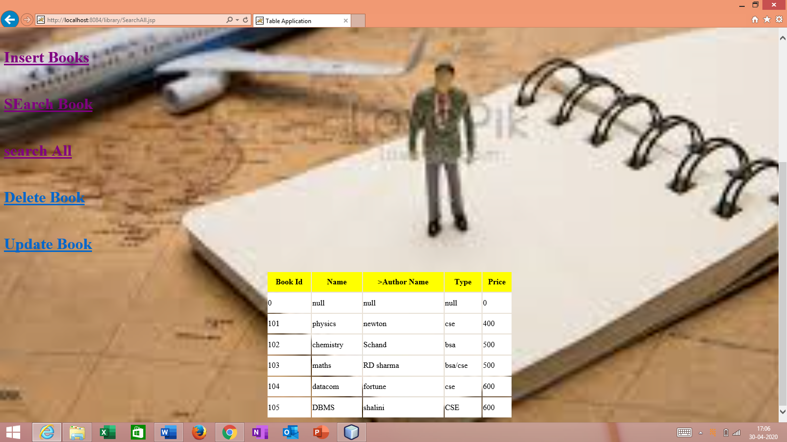
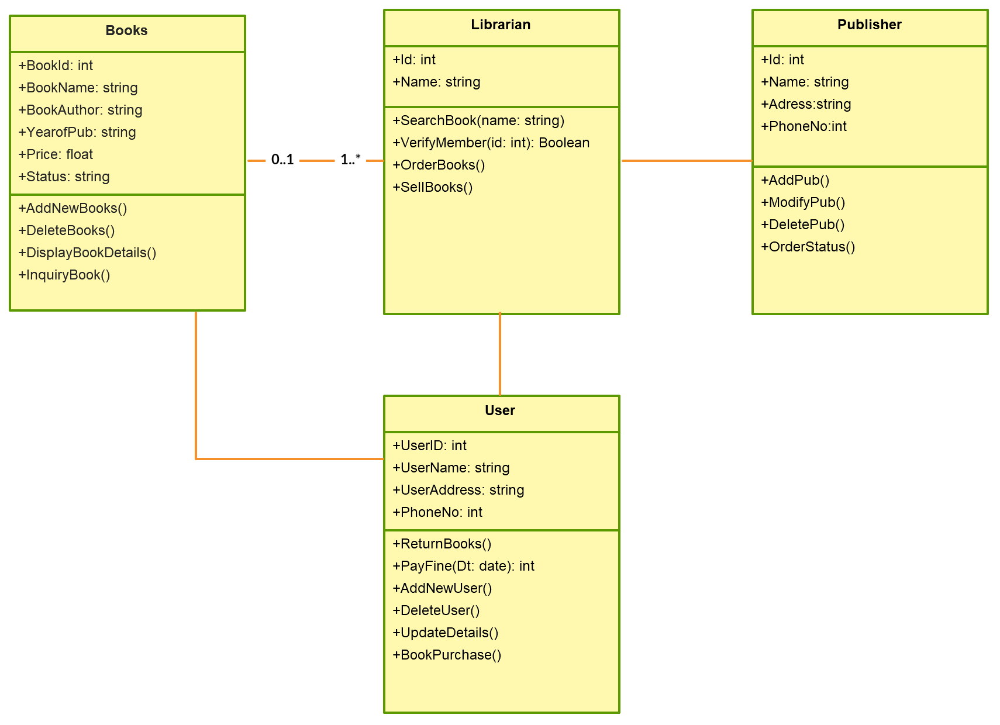

# library
<b><u>objective</b></u>
The Library Management System is an application forassisting a librarian in managing a book library in auniversity. 
The system would provide basic set of features to add/update members, add/update books, and manage check in specifications for the 
systems based on the client’s statement of need.Library management system is a typical management Information system (MIS), its Development
include the establishment and maintenance of back-end database and front-end application development aspects. 

<b><u>Users of System</b></u>
Main Librarian

<b><u>Functional Requirement</b></u>
1. can login. 
2. can add a new book 
3. can search a prticular book 
4. can see the list of books 
5. can delete a particular book 
6. can update the patricular book 
 
<b><u>Tools Used</b></u>
1.cmd and JDK and JRE 
2. OS windows 8 
3. BackEnd : mysql 
4. Front end: java, jsp,hml 
5. Database connectivity: JDBC   

<b><u>Working of project with Screen Shot</b></u>
<b>First page</b> u have login as a user with only this 2 passwords
1.user name : sak and password : 123
2. user name : anshika and password : 1234
 
this is the home page where u have login and then if your password and username is correct then u will go to the next page otherwise not.
 
 If your Id and password is correct then
  
 this is the next page where all the possibe options are present which is present in this project.
 Here u can select the option according to ur need. 
 <b> 1. add book</b> on Clicking Insert book
  
 <b>2. Search book</b> on Clicking search book 
  
  <b>3. Search All book</b> on Clicking searchall 
   
   <b>4. Delete book</b> on Clicking delete Book 
    
   <b>5. Update book</b> on Clicking update Book 
    
   
 <b><u>Activity</b></u>
<b><u>SEquence Diagram Diagram</b></u>

 

 <b><u>Class Diagram</b></u>

 
  
  
  <b><u>Flow Diagram</b></u>
  
   
   
   <b><u>ER Diagram</b></u>
  
   
   
  
